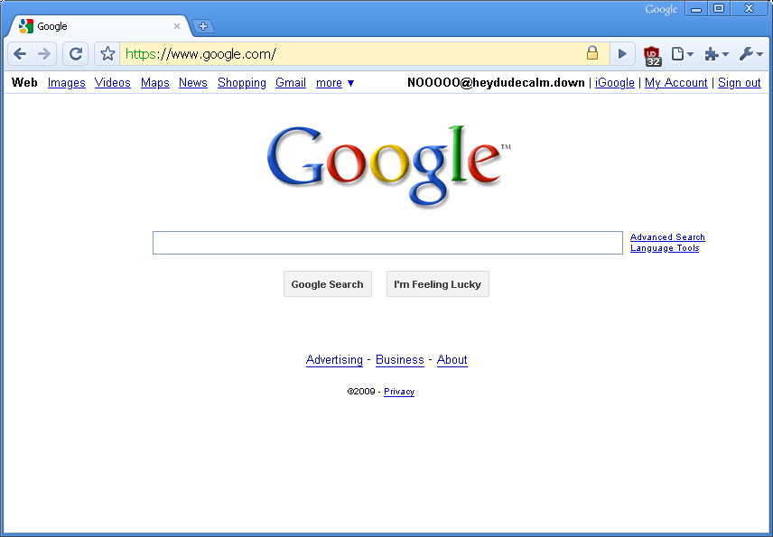
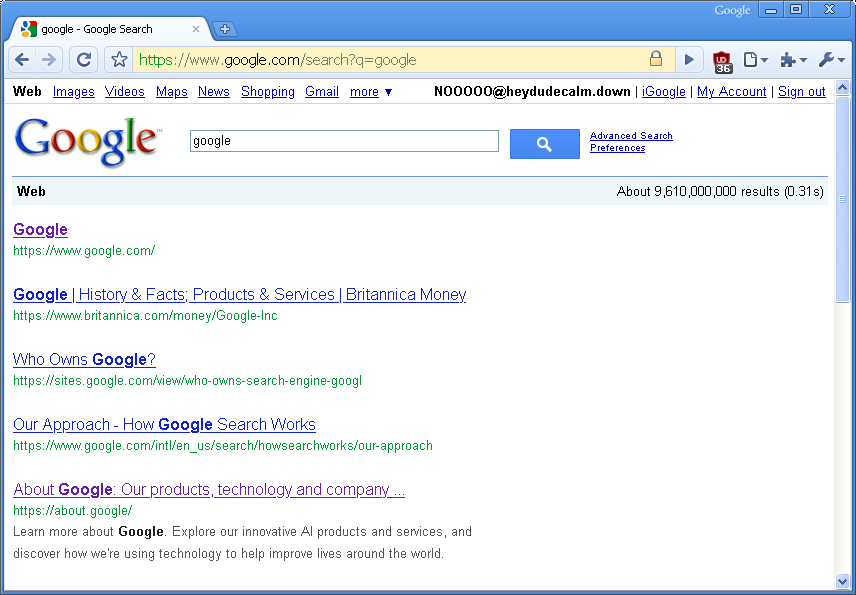

# GPlex2009
Google 2009 Theme for GPlex

Main style: [gplex2009.user.css](https://github.com/Clockiscool1234/GPlex2009/raw/refs/heads/main/gplex2009.user.css)
Script to make buttons native: [gplex2009bb.user.js](https://github.com/Clockiscool1234/GPlex2009/raw/refs/heads/main/gplex2009bb.user.js)

## REQUIRED:
Gplex: https://greasyfork.org/en/scripts/492193-gplex-old-google-frontend

Layout: 2011-2012 
Display name: Email (if not using CalyHam's GBar)

## OPTIONAL:
CalyHam's GBar: https://github.com/CallyHam/Google-Gbar/ 
2009-2011 Favicon: https://greasyfork.org/en-US/scripts/499704-google-09-11-favicon
